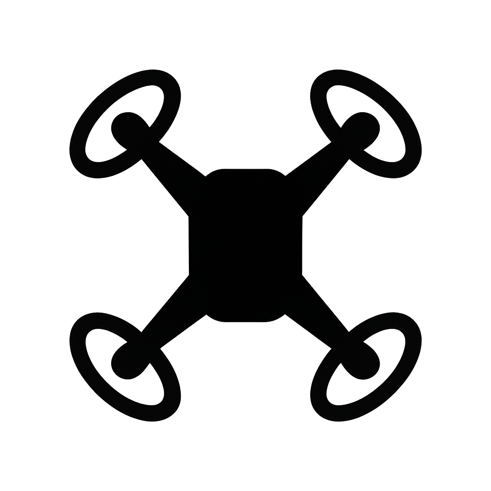

# 🛰️ SwarmDroneSim – ICRES 2025

**SwarmDroneSim** adalah simulasi **misi pencarian kotak merah** menggunakan 3 drone swarm, dikembangkan dengan **Godot 4** untuk keperluan riset dan publikasi di **ICRES 2025** (tema: *Digital Engineering and Smart Systems*).

## ✨ Fitur Utama
- **Misi Swarm Lengkap**
  - 3 drone take-off dari *HomeBase*.
  - Random assignment ke **Room1–3** untuk pencarian.
  - Deteksi **RedBox** → notifikasi oleh leader atau via sinyal member.
  - Semua drone hold posisi 10s → kembali ke HomeBase.
- **Leader Election**
  - Jika leader mati → anggota otomatis dipilih jadi leader baru.
  - Leader diberi warna **kuning emas** + label **L**, anggota berwarna **cyan**.
- **UI Interaktif**
  - Pilih lokasi RedBox (Room1–3).
  - Tombol disable leader, restart mission.
  - Toggle jejak (*Trail*), toggle heatmap, toggle panel statistik.
  - Slider kontrol **Noise Motor**.
  - Checkbox **Auto-hide Heatmap** saat fase hold.
  - Tombol **Run Demo Script** (skenario showcase otomatis).
- **Visualisasi Statistik**
  - **StatsPanel**: Histogram & boxplot waktu deteksi.
  - **Heatmap**: Intensitas jalur pencarian drone.
- **CSV Logger**
  - Semua deteksi disimpan ke `user://logs/detections.csv`.
- **BatchRunner**
  - Jalankan ratusan eksperimen otomatis (multi-run × multi-noise).
  - Hasil siap dianalisis dengan Python notebook (`analysis/analysis.ipynb`).

---

## 📂 Struktur Proyek

---

## 🚀 Cara Menjalankan
1. Buka **Godot 4.x** → *Import Project* → pilih folder repo ini.
2. Buka `Main.tscn` → jalankan (F5).
3. Gunakan panel UI di atas layar untuk kontrol simulasi.

---

## 📊 Eksperimen & Analisis
- Log hasil disimpan otomatis di:

- Untuk analisis:
1. Salin `detections.csv` ke folder `analysis/`.
2. Buka `analysis.ipynb` di Jupyter/Colab.
3. Jalankan semua sel untuk membuat histogram, boxplot, dan summary statistik.

---

## 🎥 Demo Video
👉 [Tambahkan link YouTube/Drive setelah rekaman demo presentasi]

---

## 📝 Sitasi
Jika menggunakan proyek ini untuk penelitian/akademis, sitasi sebagai berikut:

---

## 📌 Catatan
- Proyek ini dikembangkan khusus untuk **ICRES 2025**.
- Simulasi bersifat **2D** (konsep swarm & koordinasi), bukan dinamika drone fisik penuh.
- Lisensi: MIT.